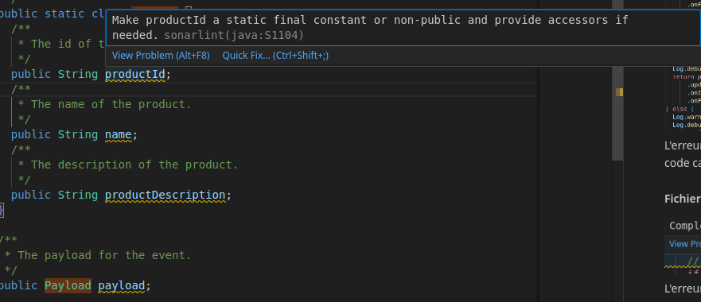
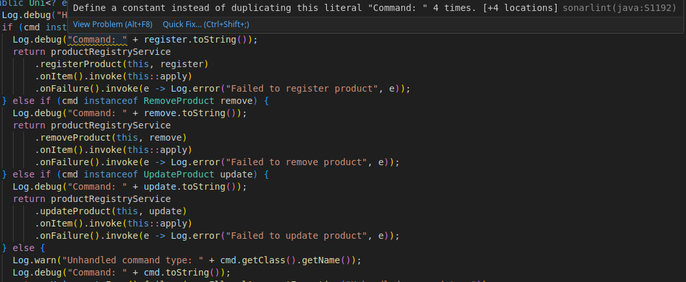
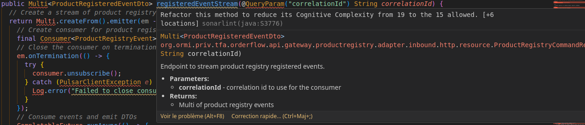
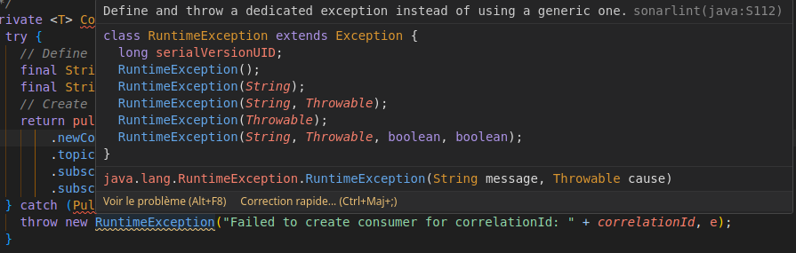
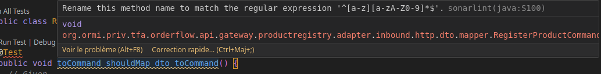
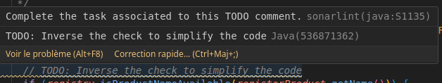
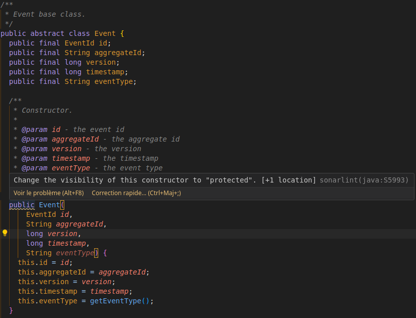
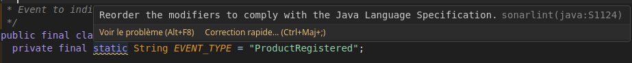
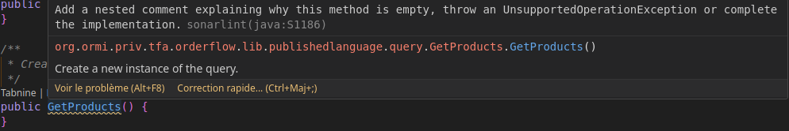
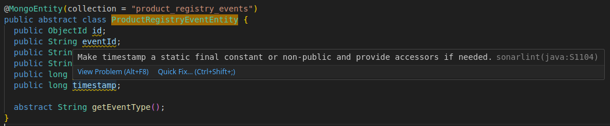

# Exercice 1 - Analayse de l'application

## Tâche 1 - Ségrégation des responsabilités

1. Quels sont les principaux domaines métiers de l'application Order flow ?

L'application Order flow repose sur un domaine principal "Shopping en ligne" et englobe plusieurs domaines principaux :

- Panier d'achat
- Traitement des commandes

2. Comment les microservices sont-ils conçus pour implémenter les domaines métiers ?

Les microservices sont conçus de manière à avoir un microservice par domaine métier. Ainsi, chaque microservice sera indépendant et permettra une scalabilité de l'application Order flow. On pourra, par exemple, améliorer un microservice spécifique sans toucher aux autres. On voit qu'il y a deux microservices : un en "Lecture" et un autre en "Écriture".

3. Quelles sont les responsabilités des conteneurs de code apps/of-api-gateway, apps/of-product-registry-microservices/product.registry, apps/of-product-registry-microservices/product.registry.read, libs/event-sourcing, libs/published-language ?

- apps/of-api-gateway : manipule les requêtes HTTP.

- apps/of-product-registry-microservices/product.registry : gérer les commandes (query) en écriture.

- apps/of-product-registry-microservices/product.registry.read : gérer les commandes (query) en lecture.

- libs/event-sourcing : sert à faire de l'event-sourcing sur les données. Trace chaque évènement d'une donnée pour pouvoir avoir l'historique de cette donnée et possiblement revenir sur une ancienne version.

- libs/published-language : définir les contextes de mappage, chaque objet et à quoi il sert.

## Tâche 2 - Identifier les concepts principaux

1. Quels sont les concepts principaux utilisés dans l'application Order flow ?

La ségrégation par domaine métiers. 

2. Comment les concepts principaux sont-ils implémentés dans les microservices ?

... (normalement réponse dans les questions précédentes)

3. Que fait la bibliothèque libs/event-sourcing ? Comment est-elle utilisée dans les microservices (relation entre métier et structure du code) ?

Elle matérialise la relation métier.

4. Comment l'implémentation actuelle de l'event-sourcing assure-t-elle la fiabilité des états internes de l'application ?

Elle assure la fiabilité car l'event-sourcing stocke chaque évènement au lieu de stocker l'état final d'un objet par exemple. Effectivement, les événements conservent l'historique complet des modifications, permettant de reconstruire l'état à tout moment en appliquant séquentiellement tous les événements ou de faire un rollback si nécessaire. Cette approche permet une traçabilité, garantit la cohérence des données et permet un débogage détaillé grâce à la possibilité de relancer chronologiquement tous les événements.

## Tâche 3 - Identifier les problèmes de qualité

### Sonarlint

J'ai utilisé Sonarlint pour analyser le code, détecter les problèmes de qualité. Pour chaque problème de qualité relevé, je vais vous le présenter et l'expliquer et proposer une correction potentielle. Plusieurs de ces problèmes se retrouvent dans plusieurs fichiers c'est pourquoi je n'ai pas mis en capture chaque fichier et je donne un exemple de cas avec le nom du ficher où elle se trouve.

#### Erreur java:S1104 -> Make ... static final constant or non-public and provide accessors if needed
L'erreur dit qu'il faudrait passer tous les attributs en `private` avec des accesseurs (meilleure solution) ou les rendre `static final`, soit statique et inchangeable car automatiquement si on a accès à l'instance de la classe on peut avoir accès à l'attribut même s'il est privé. Cette erreur se retrouve dans plusieurs classes du projet.

Correction : En vérité il faudrait utiliser des `record` plutôt que des `class` au lieu de mettre tout en privé.

Exemple de cas - fichier ProductRegisteredEventEntity.java :

#### Erreur java:S1192 -> Define a constant instead of duplicating this literal "Received event: " 3 times. [+3 locations]
L'erreur ci dessus dit qu' pour ne pas dupliquer le code car on duplique le string `"Command: "` quatre fois.
Cette erreur indique qu'une chaîne littérale (ici, "Received event: ") est répétée plusieurs fois (3 fois dans ce cas) dans le code. Cela peut rendre le code plus difficile à maintenir surtout si cette chaîne doit être modifiée, il faudrait la changer partout, ce qui est source d'erreurs potentielles.

Correction : Utiliser une constante (ici, "Received event: ") pour ne pas dupliquer le code.

Exemple de cas - fichier ProductRegistry.java :

#### Erreur java:S3776 -> Refactor this method to reduce its Cognitive Complexity from 19 to the 15 allowed. [+6 locations]
L'erreur se produit car la complexité cognitive (mesure de la difficulté à comprendre le code) dépasse 15 points à cause des multiples imbrications de conditions, boucles et blocs try/catch.

Correction : Extraire les différentes parties dans des méthodes séparées plus petites, comme par exemple sortir le traitement des événements dans une méthode `processEvent`.

Exemple de cas - fichier ProductRegistryCommandResource.java :

#### Erreur java:S112 -> Define and throw a dedicated exception instead of using a generic one
L'erreur indique que l'utilisation d'une exception générique (comme RuntimeException, Exception, etc) n'est pas recommandée car elle ne donne pas assez d'informations sur le problème spécifique. Outre cette erreur, il y a trop de levage d'exceptions dans le projet, ce qui entraîne des problèmes de performances.

Correction : Créer une classe d'exception personnalisée qui hérite d'Exception avec un nom descriptif pour mieux identifier la source et le type d'erreur.

Exemple de cas - fichier ProductRegistryQueryResource.java :

#### Erreur java:S100 -> Rename this method name to match the regular expression '^[a-z][a-zA-Z0-9]*$'
L'erreur dit que le nom de la méthode ne respecte pas la convention de nommage Java qui exige que les noms de méthodes commencent par une lettre minuscule en camelCase.

Correction : Renommer la méthode en commençant par une minuscule, dans l'exemple ci-dessous toCommandShouldMapDtoToCommand() au lieu de toCommand_shouldMap_dto_toCommand().

Exemple de cas - fichier RegistryProductCommandDtoMapperTest.java :

#### Erreur java:S1135 -> Complete the task associated to this TODO comment
L'erreur indique qu'il y a un commentaire TODO dans le code qui n'a pas été résolu/implémenté.

Correction : Soit d'implémenter la fonctionnalité manquante décrite dans le TODO, soit de supprimer le commentaire TODO si c'est plus nécessaire.

Exemple de cas - fichier ProductRegistryService.java :

#### Erreur java:S5993 -> Change the visibility of this constructor to "protected". [+1 location]
L'erreur indique que le constructeur de la classe abstraite Event devrait être `protected` au lieu de `public` car c'est une classe abstraite.

Correction : Remplacer `public` par `protected` devant le constructeur pour limiter son accès uniquement aux classes qui héritent de Event.

Exemple de cas - fichier Event.java :

#### Erreur java:S1124 -> Reorder the modifiers to comply with the Java Language Specification
L'erreur indique que l'ordre des modificateurs Java (public, protected, private, abstract, static, final, ...) n'est pas conforme à la spécification du langage Java.

Correction : Réorganiser les modificateurs dans l'ordre standard recommandé : public/protected/private (visibilité) d'abord, puis abstract/static, puis final.

Exemple de cas - fichier ProductRegistered.java :

#### Erreur java:S1186 -> Add a nested comment explaining why this method is empty, throw an UnsupportedOperationException or complete the implementation
L'erreur dit qu'une méthode vide doit soit avoir un commentaire expliquant pourquoi elle est vide, soit lever une exception en attendant, soit être implémentée.

Correction : Soit d'ajouter un commentaire // No implemented because..., soit d'ajouter throw new Exception(), soit d'implémenter la méthode avec le code nécessaire.

Exemple de cas - fichier GetProducts.java :

#### Erreur à ne pas prendre en compte - fichier ProductRegistryEventEntity.java
Ici cette erreur n'est pas à prendre en compte car il faut laisser les attributs en public du fait que c'est une entité de MongoDB.

### Autres erreurs
Outre les problèmes de qualité observés grâce à Sonarlint, il manque de la javadoc sur certaines méthodes et classes, ainsi que des commentaires notamment sur le microservice de registre de produits. Il manque également des tests unitaires et d'intégration car il y en a très peu et incomplets.

Puis, il faudrait différencier les cas d'erreurs métier (utilisateur) et technique (interne au code), si c'est une erreur métier cela, par exemple, permettra de la remonter à l'utilisateur.

Voici le schéma récapitulant l'objectif à atteindre que l'on a pu comprendre en cours de TP :

#

BOURREAU Quentin - BUT Info 3.1.B